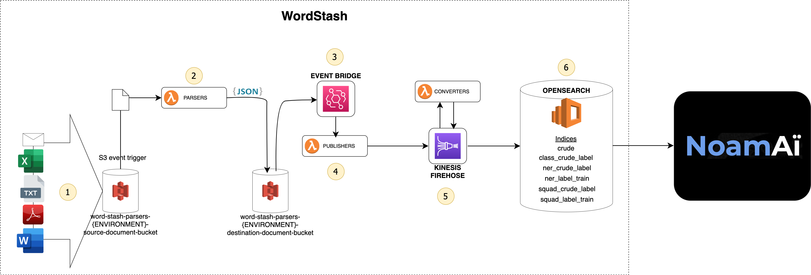
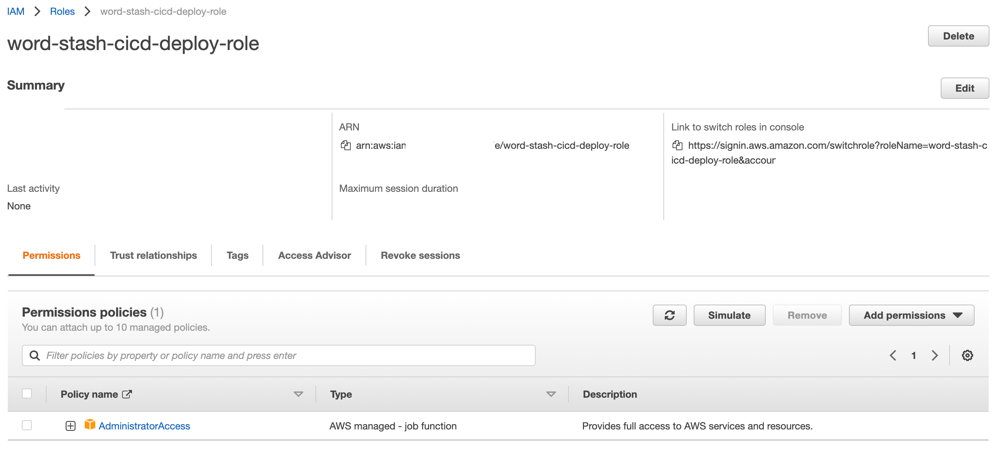
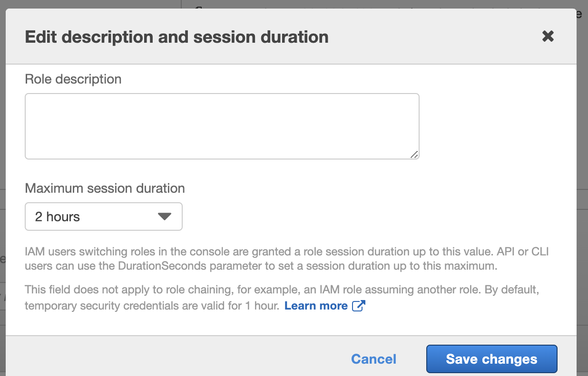
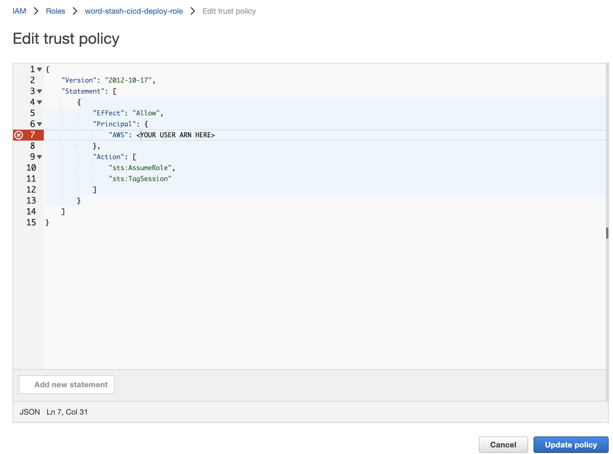
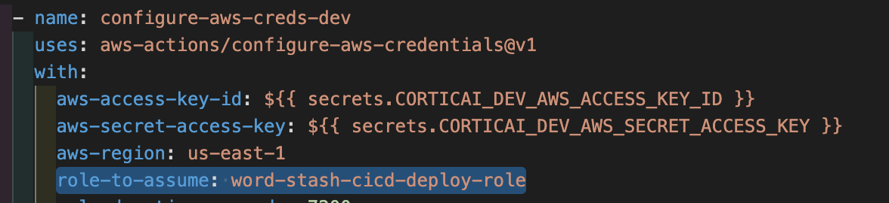
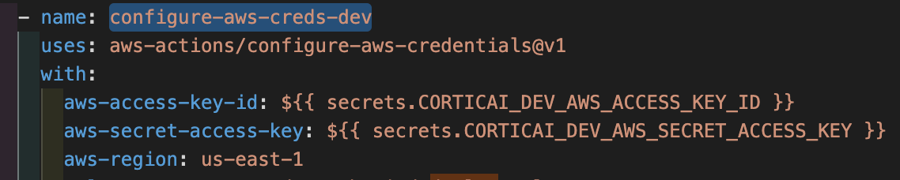
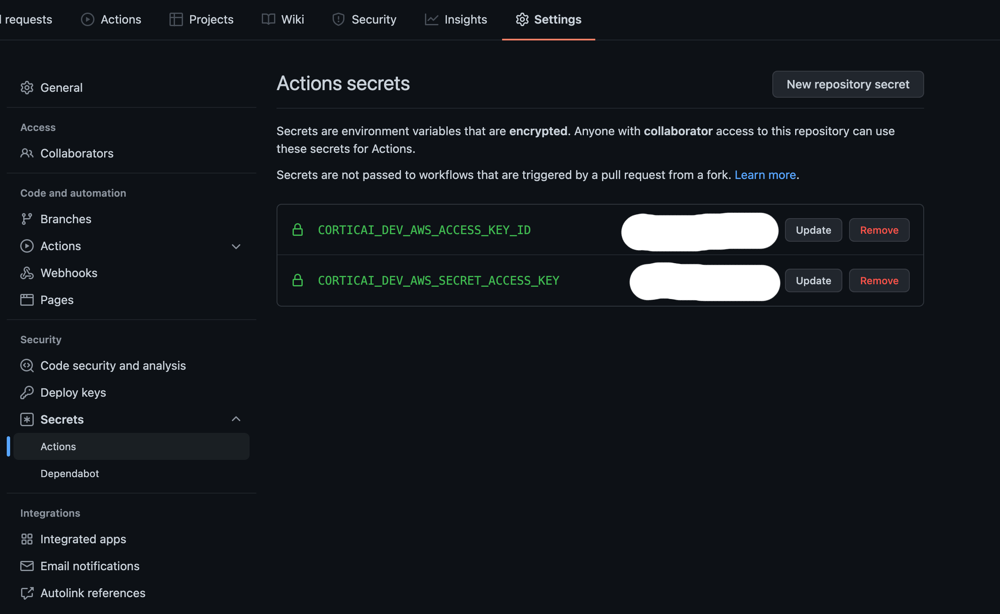

# WordStash



## Project Description

### What Does It Do
WordStash is a platform that automatically extracts text from documents and stores it in a searchable format. It transforms documents into data that can be used for machine learning purposes.

The transformation process occurs in 4 stages - [Document Parsing](#document-parsing), [Payload Publishing](#payload-publishing), [Payload Conversion](#payload-conversion) and [Data Storage](#data-storage).

#### Document Parsing
Textual documents are ingested, and chunked json payload representations of the documents are created during the Document Parsing stage. The system is able to parse the following file formats:
- CSV files
- Word documents (docx)
- Emails (eml) and attachments that fall in the allowed file formats
- PDFs
- Text files (txt)
- Excel spreadsheets (excel)

#### Payload Publishing
The parsed payload representations are published as notifications to downstream systems.

#### Payload Conversion
The payload representations are transformed into one of the following machine learning formats:
- [Text classification](https://developers.google.com/machine-learning/guides/text-classification)
- [Extractive question answering (SQuAD)](https://rajpurkar.github.io/SQuAD-explorer/)
- Part of Speech tagging formats:
    - [BILUO](https://towardsdatascience.com/extend-named-entity-recogniser-ner-to-label-new-entities-with-spacy-339ee5979044)
    - [Named Entity Recognition](https://cs230.stanford.edu/blog/namedentity/)

#### Data Storage 
The payloads are stored into a search engine database.

## Table of Contents
1. [Prerequisites](#prerequisites)
1. [Project Repository Folder Structure](#project-repository-folder-structure)
1. [Instructions to Test the Code Locally](#instructions-to-test-the-code-locally)
1. [Deploying the Code from a Local Workstation](#deploying-the-code-from-a-local-workstation)
1. [Deploying the Code using Github Actions](#deploying-the-code-using-github-actions)
1. [Instructions to Use WordStash](#instructions-to-use-wordstash)
1. [Technical Architecture](#technical-architecture)
1. [JSON Payload Formats](#json-payload-formats)
1. [Technologies](#technologies)
1. [Furture Work](#future-work)


## Prerequisites
The following is required to deploy WordStash:

1. [AWS account](https://aws.amazon.com/premiumsupport/knowledge-center/create-and-activate-aws-account/)
1. [Github account](https://github.com/join)
1. [Docker 19.03 or above - Download Docker](https://www.docker.com/products/docker-desktop)
1. [Docker Compose 1.27 or above - (Note that Docker for MacOS comes with Docker Compose)](https://docs.docker.com/compose/)
1. [GNU Make (which is pre-installed on MacOs and Linux)](https://www.gnu.org/software/make/)
1. [Python 3.8 or above (with Pip)](https://www.python.org/downloads/)
1. [AWS command line interface](https://aws.amazon.com/cli/)

## Project Repository Folder Structure
```
├── .github
│   └── workflows
├── cloudformation
├── config
│   └── dev
├── impleter
│   ├── converters
|   │   ├── scripts
|   │   ├── src
|   │   └── tests
│   ├── parsers
│   │   ├── scripts
│   │   ├── src
│   │   └── tests
│   └── publishers
│       ├── scripts
│       ├── src
│       └── tests
├── kibana
├── local-dependencies
|   ├── lambda-packager
│   │   ├── converters
│   │   ├── parsers
│   │   └── publishers
|   |
|   ├── lambda-tester
│   │   └── impleter
|   |
|   ├── OpenSearch
|   |
|   └── tester
│       └── impleter
└── scripts
```

## Instructions To Test the Code Locally
To run the tests locally, execute the following command in the parent directory:
```
make test
```

## Deploying the Code from a Local Workstation
1. Create an [AWS account](https://aws.amazon.com/premiumsupport/knowledge-center/create-and-activate-aws-account/) if you do not have an existing account. Otherwise, skip this step.
1. Create an [AWS admin user](https://docs.aws.amazon.com/IAM/latest/UserGuide/getting-started_create-admin-group.html).
1. Generate new [AWS credentials](https://docs.aws.amazon.com/sdk-for-javascript/v2/developer-guide/getting-your-credentials.html) for the user created in the previous step.
1. Ensure that you have [setup your AWS credentials](https://docs.aws.amazon.com/sdk-for-java/v1/developer-guide/setup-credentials.html) on your local workstation prior to deploying the code.
1. To deploy the code, execute the following command in the parent directory:
```
make deploy-local
```

## Deploying the Code using Github Actions
WordStash can be deployed to AWS via [Github actions](https://github.com/features/actions). It does so automatically on a commit and push to the the main branch.

Below are the instructions for the AWS and GitHub setup prerequisites.

### AWS Account
1. Create an [AWS account](https://aws.amazon.com/premiumsupport/knowledge-center/create-and-activate-aws-account/) if you do not have an existing account. Otherwise, skip this step.

#### IAM User
1. Create a new [AWS user](https://docs.aws.amazon.com/IAM/latest/UserGuide/id_users_create.html)
1. [Create an inline policy](https://docs.aws.amazon.com/IAM/latest/UserGuide/access_policies_manage-attach-detach.html) for the user. Go to permissions -> Add inline policy -> JSON, and add the below JSON policy to the user:
    ```
        {
            "Version": "2012-10-17",
            "Statement": [
                {
                    "Action": [
                        "sts:TagSession",
                        "sts:AssumeRole"
                    ],
                    "Resource": "*",
                    "Effect": "Allow",
                    "Sid": "AllowAssumeCiCdRole"
                }
            ]
        }
    ```
1. Click on "Review Policy" followed by "Create Policy".
1. Create new [AWS credentials](https://docs.aws.amazon.com/sdk-for-javascript/v2/developer-guide/getting-your-credentials.html) for the IAM user. Take note of the access key id and secret access key.
1. Take note of the User's ARN.

#### IAM Role
1. Create an [AWS account role in IAM](https://docs.aws.amazon.com/IAM/latest/UserGuide/id_roles_create_for-user.html) with AdminstratorAccess permissions.
    
1. Click on the "Edit" button, and set the Maximum session duration to 2 hours.
    
1. Click on "Save Changes".
1. Go to Trust relationships, and [edit the trust policy](https://docs.aws.amazon.com/directoryservice/latest/admin-guide/edit_trust.html) with the below JSON. Enter the AWS user's ARN as per indicated:
    ```
            {
                "Version": "2012-10-17",
                "Statement": [
                    {
                        "Effect": "Allow",
                        "Principal": {
                            "AWS": <YOUR USER ARN HERE>
                        },
                        "Action": [
                            "sts:AssumeRole",
                            "sts:TagSession"
                        ]
                    }
                ]
            }
    ```
    
1. Click on "Update Policy".
1. Take note of the IAM role name.
1. Set the role-to-assume on .github/workflows/deploy.yml to the IAM role name.
     

#### AWS Region
1. Set your preferred AWS region in .github/workflows/deploy.yml (configure-aws-creds-dev->with->aws-region)
    

### Github Account
1. Create a [Github account](https://github.com/join)
1. Create a [private fork of the WordStash repo](https://gist.github.com/0xjac/85097472043b697ab57ba1b1c7530274)
1. Using the previously created AWS credentials, generate the following secrets for the forked repo via [Github Action's secrets](https://docs.github.com/en/actions/security-guides/encrypted-secrets):

Secret Name | Secret Value
----------- | ------------
CORTICAI_DEV_AWS_ACCESS_KEY_ID| AWS access key id
CORTICAI_DEV_AWS_SECRET_ACCESS_KEY| AWS secret access key




## Instructions to Use WordStash
Upload files that are [compatible](#document-parsing) with WordStash to the word-stash-source-document-bucket S3 bucket.

Below is an AWS command line interface example:
```
aws s3 cp impleter/parsers/tests/data/example.csv s3://word-stash-source-document-bucket
```

The transformed document should be transformed and stored in the word-stash-db-{ENVIRONMENT} OpenSearch service. Follow the instructions in this [link](https://aws.amazon.com/premiumsupport/knowledge-center/OpenSearch-outside-vpc-ssh/) to access OpenSearch via Kibana.

## Technical Architecture


The end to end WordStash workflow is as follows:

1. File upload to S3 word-stash-source-document-bucket bucket. Files that are [compatible](#document-parsing) with WordStash generate an S3 event trigger.

1. File parser lambda functions are triggered by these S3 event triggers. They split and transform the documents into json payload representations of the document. The json payloads are stored in the S3 word-stash-destination-document-bucket bucket. The code can be found in the ./word-stash/impleter/parsers/src directory:
    - csv_dict_lambda_function.py - CSV files
    - docx_dict_lambda_function.py - Word documents (docx)
    - email_dict_lambda_function.py - Emails (eml) and attachments that fall in the allowed file formats
    - ner_label_dict_lambda_function.py - BILUO annotated Named Entity Recognition (NER) parser.
    - pdf_dict_lambda_function.py - PDFs
    - squad_label_dict_lambda_function.py - SQuAD annotated extractive question-answer parser.
    - txt_dict_lambda_function.py - Text files (txt)
    - xlsx_dict_lambda_function.py - Excel spreadsheets (excel)

1. Eventbridge triggers Publisher lambda functions when files are stored in the S3 word-stash-destination-document-bucket bucket.

1. The Publisher lambda functions send the json payloads to the respective Kinesis Firehose delivery streams. (publisher code can be found at ./word-stash/impleter/publishers/src):
    - eb_s3_firehose_crude_json_lambda_function.py - lambda function that published to the Crude Firehose delivery stream.
    - eb_s3_firehose_ner_label_json_lambda_function.py - lambda function that published to the annotated NER BILUO Firehose delivery stream.
    - eb_s3_firehose_squad_label_json_lambda_function.py - lambda function that published to the annotated SQuAD Firehose delivery stream.

1. The Kinesis Firehose delivery streams store the json payloads into the OpenSearch search engine. The payloads are converted by lambda functions prior to being saved (code can be found in the ./word-stash/impleter/converters/src directory)
    - class_crude_to_label_lambda_function.py - converts a Crude json payload to a text classification format. 
    - ner_crude_to_label_lambda_function.py - converts a Crude json payload to a NER BILUO format. 
    - ner_label_to_train_lambda_function.py - converts a NER BILUO json payload to a Huggingface Transformer NER format. 
    - squad_crude_to_label_lambda_function.py - converts a Crude json payload to a SQuAD annotated extractive question-answer format. 
    - squad_label_to_train_lambda_function.py - converts a SQuAD annotated extractive question-answer payload to a Huggingface Transformer SQuAD format. 
    
1. The payloads are stored in the following OpenSearch indices:
    - crude - converted [Crude json payloads](#crude-payload) from all Kinesis delivery streams.
    - class_crude_label - [Text classification](#text-classification-payload) json payloads.
    - ner_crude_label - [NER BILUO](#ner-biluo-payload) json payloads.
    - ner_label_train - [Huggingface Transformer NER](#huggingface-transformer-ner-payload) json payloads.
    - squad_crude_label - [SQuAD annotated extractive question-answer](#squad-annotated-exractive-question-answer-payload) json payloads.
    - squad_label_train - [Huggingface Transformer SQuAD](#huggingface-transformer-squad-payload) json payloads.

## JSON Payload Formats

### Crude Payload
The Crude payload has the following schema properties:
```
{
    "type": "object",
    "properties": {
        "filename": {
            "type": ["string", "null"]
        },
        "filetype": {
            "type": ["string", "null"]
        },
        "index": {
            "type": "integer"
        },
        "id": {
            "type": "string"
        },
        "content": {
            "type": ["string", "null"]
        },
        "content2": {
            "type": ["string", "null"]
        }
    },
    "required": ["index", "id", "content"]
}
```
An example payload:
```
{
  "data": [
    {
      "timestamp": "2022-02-03T09:48:09.041402",
      "filetype": "txt",
      "index": 0,
      "id": "6e78737f-067b-490e-ba08-efaf53138871-20220203_174809",
      "content": "Nam dignissim ac nisi eu pellentesque. Aliquam viverra felis et purus pharetra, et vestibulum turpis porta. Pellentesque tellus turpis, cursus id eros at, congue malesuada eros. Maecenas neque magna, dictum ac fringilla eu, mattis in metus. Curabitur aliquet nibh nulla, et ultricies nibh aliquam ac. Sed eget elit suscipit, luctus libero at, faucibus leo. Vestibulum et eros nec urna viverra pretium sit amet vitae justo.\n\nCurabitur pellentesque mauris nec ornare aliquam. Maecenas porttitor varius risus eu convallis. Phasellus ipsum metus, condimentum pretium ullamcorper ac, maximus non velit. Phasellus a nisl sit amet augue molestie bibendum. Cras arcu lorem, pulvinar nec neque"
    }
  ]
}
```

### Text Classification Payload
The Text classification payload has the following schema properties:
```
{
    "type": "object",
    "properties": {
        "filename": {
            "type": ["string", "null"]
        },
        "filetype": {
            "type": ["string", "null"]
        },
        "index": {
            "type": "integer"
        },
        "id": {
            "type": "string"
        },
        "content": {
            "type": ["string", "null"]
        },
        "content2": {
            "type": ["string", "null"]
        },
        "label": {
            "type": ["string", "null"]
        }
    },
    "required": ["index", "id", "content"]
}
```

An example payload:
```
{
    "timestamp": "2022-02-03T09:48:09.041402",
    "filetype": "txt",
    "index": 0,
    "id": "6e78737f-067b-490e-ba08-efaf53138871-20220203_174809",
    "content": "Nam dignissim ac nisi eu pellentesque. Aliquam viverra felis et purus pharetra, et vestibulum turpis porta. Pellentesque tellus turpis, cursus id eros at, congue malesuada eros. Maecenas neque magna, dictum ac fringilla eu, mattis in metus. Curabitur aliquet nibh nulla, et ultricies nibh aliquam ac. Sed eget elit suscipit, luctus libero at, faucibus leo. Vestibulum et eros nec urna viverra pretium sit amet vitae justo.\n\nCurabitur pellentesque mauris nec ornare aliquam. Maecenas porttitor varius risus eu convallis. Phasellus ipsum metus, condimentum pretium ullamcorper ac, maximus non velit. Phasellus a nisl sit amet augue molestie bibendum. Cras arcu lorem, pulvinar nec neque",
    "label": "neutral_sentiment"
}
```

### NER BILUO Payload
The NER BILUO payload has the following schema properties:
```
{
    "type": "object",
    "properties": {
        "filename": {
            "type": ["string", "null"]
        },
        "filetype": {
            "type": ["string", "null"]
        },
        "index": {
            "type": "integer"
        },
        "id": {
            "type": "string"
        },
        "text": {
            "type": "string"
        },
        "label": {
            "type": "array",
            "items": {
                "type": "array",
                "prefixItems": [
                    {
                        "type": ["integer", "string"]
                    }, 
                    {
                        "type": ["integer", "string"]
                    },
                    {
                        "type": "string"
                    }
                ]
            }
        }
    },
    "required": ["index", "id", "text", "label"]
}
```

An example payload:
```
{
    "index": 0,    
    "id": "DEV-865",
    "text": "API: generate password is required",
    "label": [[5, 21, "SYSTEM-ADMINISTRATION"]]
}
```

### Huggingface Transformer NER Payload
The Huggingface Transformer NER payload has the following schema properties:
```
{
    "type": "object",
    "properties": {
        "filename": {
            "type": ["string", "null"]
        },
        "filetype": {
            "type": ["string", "null"]
        },
        "index": {
            "type": "integer"
        },
        "id": {
            "type": "string"
        },
        "text": {
            "type": "array",
            "items": {
                "type": "string"
            }
        },
        "label": {
            "type": "array",
            "items": {
                "type": "string"
            }
        }
    },
    "required": ["index", "id", "text", "label"]
}
```

An example payload:
```
{
    "index": 0,
    "id": "DEV-865",
    "text": ["The", "field", "of", "machine", "learning", "has", "made", "tremendous", "progress", "over", "the", "past", "decade"],
    "label": ['O', 'U-LOC', 'O', 'O', 'O', 'O', 'O', 'O', 'O', 'O', 'O', 'O', 'O']
}
```

### SQuAD Annotated Exractive Question Answer Payload
The SQuAD annotated extractive question-answer payload has the following schema properties: 
```
{
    "type": "object",
    "properties": {
        "filename": {
            "type": ["string", "null"]
        },
        "filetype": {
            "type": ["string", "null"]
        },
        "index": {
            "type": "integer"
        },
        "id": {
            "type": "string"
        },
        "context": {
            "type": "string"
        },
        "qas": {
            "type": "array",
            "items": {
                "type": "object",
                "properties": {
                    "question": {
                        "type": "string"
                    },
                    "answers": {
                        "type": "array",
                        "items": {
                            "type": "object",
                            "properties": {
                                "answer_start": {
                                    "type": "integer"
                                },
                                "text": {
                                    "type": ["string", "null"]
                                }
                             }
                        }
                    }
                }
            }
        }
    },
    "required": ["index", "id", "context", "qas"]
}
```

An example payload:
```
{
    "id": "623ddfda-851b-4a8c-acb7-e5598558ff2f",
    "index": 0,
    "context": "The field of machine learning has made tremendous progress over the past decade.",
    "qas": [
        {
            "question": "What has made progress?",
            "id": "aae57aac-8246-48e5-ba01-f58185edaca4",
            "answers": [
                {
                  "answer_start": 4,
                  "text": "field of machine learning"
                }
            ]
        }
    ]
}
```

### Huggingface Transformer SQuAD Payload
The Huggingface Transformer SQuAD payload has the following schema properties: 
```
{
    "type": "object",
    "properties": {
        "filename": {
            "type": ["string", "null"]
        },
        "filetype": {
            "type": ["string", "null"]
        },
        "index": {
            "type": "integer"
        },
        "id": {
            "type": "string"
        },
        "context": {
            "type": "string"
        },
        "question": {
            "type": "string"
        },
        "answers": {
            "type": "object",
            "properties": {
                "answer_start": {
                    "type": "array",
                    "items": {
                        "type": "integer"
                    }
                },
                "text": {
                    "type": "array",
                    "items": {
                        "type": ["string", "null"]
                    }
                }
            }
        }
    },
    "required": ["index", "id", "context", "question", "answers"]
}
```

An example payload:
```
{
    "id": "57639482-160721-1931_f846bbc6-b4ae-437d-bd90-4df09285d2bb-20220204_142245_0",
    "title": "Machine Learning Progress",
    "context": "The field of machine learning has made tremendous progress over the past decade",
    "question": "What has made progress?",
    "answers": {
        "answer_start": [4],
        "text": ["field of machine learning"]
    }
}
```

## Technologies
The WordStash technologies:
- Simple Storage Service (S3)
- AWS Lambda
- Event Bridge
- Kinesis Firehose
- OpenSearch

### Simple Storage Service (S3)
WordStash stores and persists transit data on S3 in the interim as it is parsed, converted, and stored into the platforms final search engine database destination. We have decided on S3 to store the transient data as it is low cost, claims 99.99% availability and secure.

### AWS Lambda
The WordStash core features of parsing, converting and storing textual documents are written in python. The pipeline is event driven. Execution parallelability is paramount so as to fully take advantage of AWS scalable services like Kinesis and OpenSearch. AWS Lambda was chosen as a framework to implement these core features as it supports most coding languages out of the box. It has a pay as you use pricing model, doesn't require infrastructure to manage, and can be run and tested locally. The service is also highly scalable and has the ability to seamlessly integrate with other AWS native services.

### Event Bridge
One of WordStash's requirement is for an asynchronous, event driven messaging system so that documents can be processed in parallel at scale. 

Event Bridge was selected to fulfil the requirement as:
- It has a loose-coupled architecture.
- The components involved can be isolated.
- It makes it easy to extend or replace services.
- It enables a zero-waste architecture.
- The schema registry makes it very easy to manage large scale applications.
- There is a vast number of options in terms of integration with both native and third party services/APIs. 

### Kinesis Firehose
The system had to have the functionality to stream data (i.e. converted json payloads) to different destination databases or data stores.
Kinesis Firehose is the applied service as:
- It can work on streaming data as it streams.
- It provides real time insights.
- It is serverless and has a pay as you go pricing model.
- Its highly scalable.
- There is no need to learn new languages, frameworks, or machine learning algorithms.
- There is a vast number of options in terms of integration with both native and third party data stores. 

### OpenSearch
The documents are stored on OpenSearch as:
- It is built to scale.
- It has fast performance as it uses distributed inverted indices, to quickly find the best matches for full-text searches on very large data sets.
- It is multilingual.
- It is document oriented (JSON).
- It is schema free.

## Future Work
Some food for thought:
- Compatibility with other file formats.
- Implement a multi-tenanted architecture.
